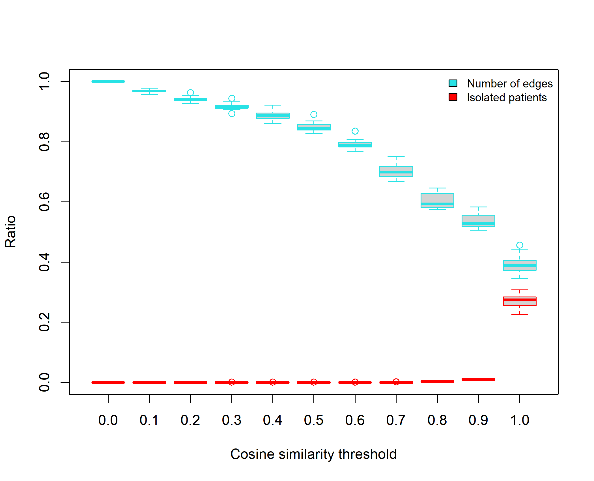
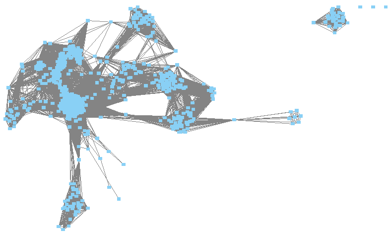
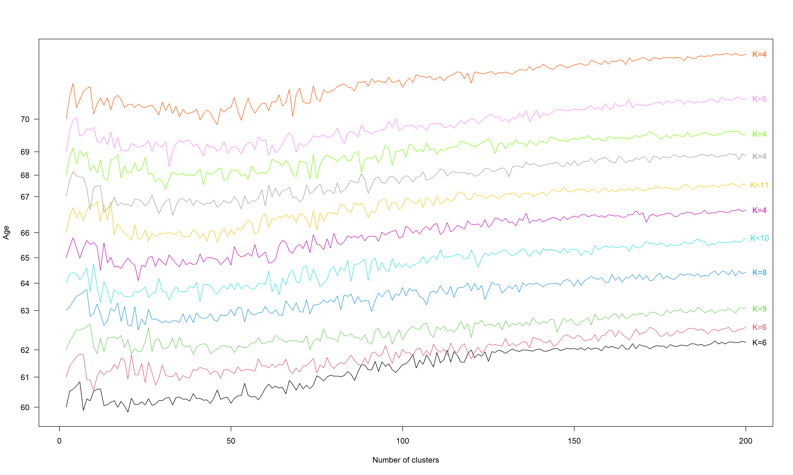
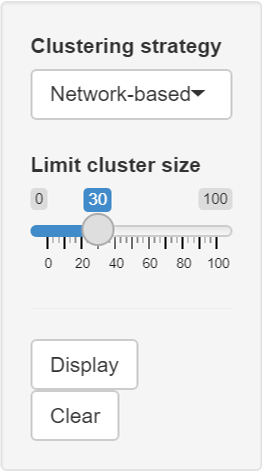

# Cluster-tracking approach
We propose novel approaches based on cluster-tracking for clustering patients from longitudinal data extracted from medico-administrative databases. These approaches start by identifying clusters of patients at each considered age. To this goal, we used two different clustering strategies: Markov Cluster algorithm (MCL) applied on patient networks built from raw data and Kmeans applied directly on raw data. Clusters are then tracked over ages to define cluster-trajectories. We applied our approaches to the analysis of antithrombotic drug prescriptions (i.e., raw data) extracted from the Echantillon Généraliste des Bénéficiaires (EGB, a French cohort) between 2008 and 2018 in patients aged from 60 to 70 years old. From this data, we simulated 5594 patients with their drug prescriptions. This simulated sample is used in the following to apply our two cluster-tracking approaches.

## Identifying clusters of patients from patient networks
The first clustering strategy used to identify clusters of patients relies on the construction of patient networks. We started by constructing a patient network for each age considered. We then applied the MCL clustering algorithm on each network.

### Constructing patient networks
A patient network is a graph $G = (V,E)$ with $V$ patient nodes and $E$ edges representing interactions between patient nodes. We built a network for each patient age. Each network is constructed using a similarity matrix. In this similarity matrix, we computed the similarity between patients of the same age using the Cosine similarity.

```python
import pandas as pd
from sklearn.metrics.pairwise import cosine_similarity

#Construction of the similarity matrix at age 60

#Table of prescriptions at age 60
pres_tab = pd.read_csv("Data/pres_60.csv", sep = ";")

#Computation of the Cosine similarity between patients 
cos_DF = pd.DataFrame(cosine_similarity(pres_tab),
                      columns = pres_tab.index.astype("str"),
                      index = pres_tab.index.astype("str")) 

#Save
cos_DF.to_parquet("Data/cosine_60.gzip", compression="gzip")  
```

We then filtered the similaritry matrices according to a threshold. This threshold is chosen over all the matrices in order to reduce the number of edges in the networks while obtaining a minimum number of isolated patients. From the matrices constructed with the simulated sample, we choose a threshold of 0.7 because this is where we observe the fastest decrease in the number of edges and there is only a small number of isolated patients (see figure below). 



From each filtered matrix, we obtained a patient network in which patients are connected only if they have a Cosine similarity $\ge 0.7$. The patient network at 60 years of age is represented in the figure below.



### Clustering patient networks
We applied the Markov Cluster algorithm (MCL) on the largest connected component of each patient network constructed.

```python
import pandas as pd
import numpy as np
import networkx as nx
import markov_clustering as mc

#Similarity matrix at age 60
cos_tab = pd.read_parquet("Data/cosine_60.gzip")
cos_tab.values[[np.arange(cos_tab.shape[0])]*2] = 0 #We set the diagonal of the matrix to 0
cos_tab.mask(cos_tab<0.7, 0, inplace=True) #We filtered the matrix with the chosen Cosine similarity threshold = 0.7

#Network construction
G = nx.from_pandas_adjacency(cos_tab)

#Component extraction
Gcc1 = sorted(nx.connected_components(G), key = len, reverse = True)[0] #The largest connected component
Gcc2 = sorted(nx.connected_components(G), key = len, reverse = True)[1:] #The other connected components

#Largest connected component network
G = G.subgraph(Gcc1) 

#Exctraction of clusters from MCL algorithm applied on the largest connected component network
mat = nx.to_scipy_sparse_matrix(G)
mcl = mc.run_mcl(mat) 
clust = mc.get_clusters(mcl) #list of identified clusters
pat = list(G.nodes()) #Patient IDs
res = []
for y in np.arange(len(clust)):
    for j in clust[y] :
        res.append([pat[j], y+1]) #Patient ids + cluster they belong to

#Extraction of clusters from the other connected components: each connected component represent a cluster
y = y+2 #next cluster
if len(Gcc2)!=0:
    for g in Gcc2:
        for pat in g:
            res.append([pat, y]) #Patient ids + cluster they belong to
        y = y+1

clust_data = pd.DataFrame(res, columns=['Patient', 'cluster'])

#Save
clust_data.to_csv("Data/clusters_net_60.csv", sep = ";", index = False)
```

## Identifying clusters of patients from raw data
The second clustering strategy used to identify clusters of patients relies on raw data. We used Kmeans that we applied directly on raw data, for each patient age. As in Kmeans the number of clusters must be specified *a priori*, we determined the optimal number of clusters per age by calculating the silhouette score. We varied the number of clusters from 2 to 200. The optimal number of clusters $K$ identified at each age from the simulated sample is represented in the figure below. 



We can therefore apply Kmeans at each age with the optimal number of clusters identified.

```python
import pandas as pd
from sklearn.cluster import KMeans

#Table of prescriptions at age 60
pres_tab = pd.read_csv("Data/pres_60.csv", sep = ";")

#Kmeans applied with 6 clusters, the optimal number of cluster identified at age 60
KM = KMeans(n_clusters=6).fit(pres_tab.values)
label = KM.labels_
id_label = pres_tab.indexm
res = []
for j in np.arange(len(label)) :
        res.append([id_label[j], label[j]+1]) #Patient ids + cluster they belong
clust_data = pd.DataFrame(res, columns=['Patient', 'cluster'])

#Save
clust_data.to_csv("Data/clusters_raw_60.csv" , sep = ";", index = False)
```

## Tracking clusters over ages
We identified sets of clusters per age either from patient networks with MCL or from raw data with Kmeans. We then intend to follow the clusters over the different ages. To this goal, we computed the number of common patients between every pair of clusters obtained at 2 consecutive ages. By considering only the greatest number of common patients between all consecutive clusters, we were able to identify sets of successive clusters that we called cluster-trajectories.

To visualize the tracking of clusters and the cluster-trajectories from the simulated data, we developped an R Shiny app. The tracking of clusters is visualized using an alluvial plot, in which the blocks represent the clusters and the stream fields between the blocks represent the number of common patients. The cluster-trajectories are visualized using a flowchart composed of blocks representing the clusters. The arrow thickness between the blocks represents the number of common patients. All clusters displayed in the flowchart are characterized by the two most prescribed drugs (name, percentage of patients receiving the drug), the sex ratio (SR) and the total number of patients (n). These clusters are named with the age at which it was identified and its label (age.label).



This R shiny app allows to choose between the two clustering strategies and to display clusters greater than or equal to the selected limit size. The following code should be executed in R to launch the application:

```{r}
library(shiny)

runGitHub("Cluster-tracking", "JudithLamb")
```
